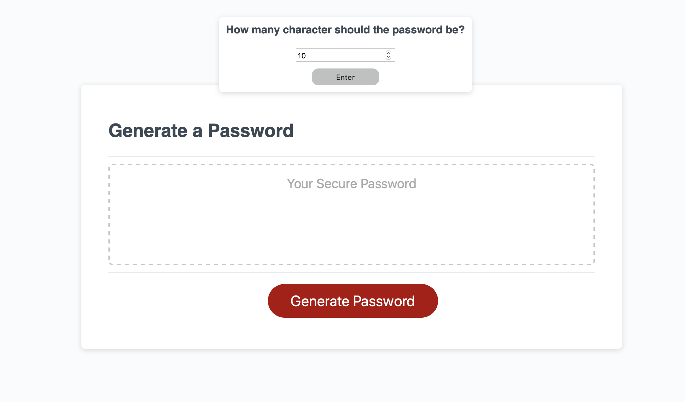
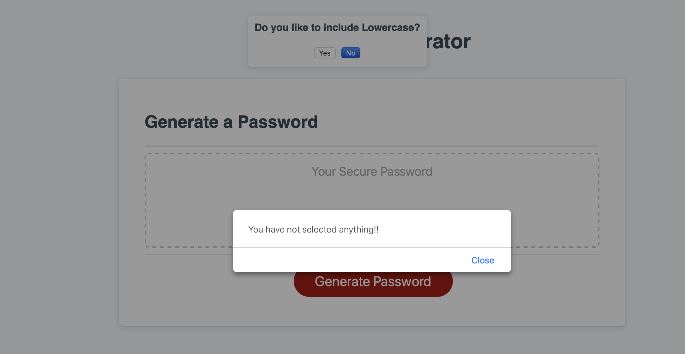
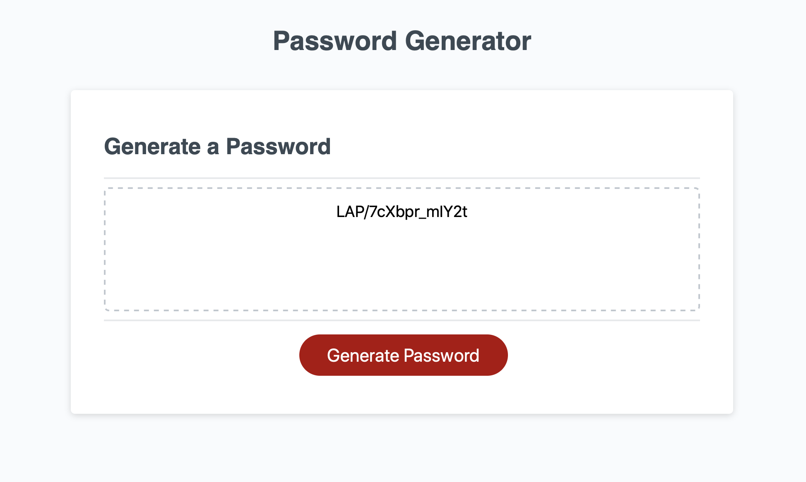

# JavaScript: Password Generator

## Description

Password Generator is an application that enables user to generate random passwords based on criteria that they’ve selected. This app will run in the browser and will feature dynamically updated [HTML](https://developer.mozilla.org/en-US/docs/Web/HTML), [CSS](https://developer.mozilla.org/en-US/docs/Web/CSS), and [javascript](https://developer.mozilla.org/en-US/docs/Web/JavaScript). For the great user experinece it has a clean, polished, and responsive user interface that adapts to multiple screen sizes.


## Feature List:
```sh
* User will have access to promts for the password criteria.
* User can selcets lowercase, uppercase, numeric, and/or special characters
* User can genereate a strong password that provides greater security

 For the convenient, and great visual experience, it has made simple, responsive, and colorful with appropriate css style. 
 ```


## Screenshots:
Here, are few quick glimses of this application
### First dialog box to make the charaters selection

 

### Alert box if user made no any character selection  

 

 ### Final random generated passwords 

 


## Links :


* Link for the deployed application [Password Generator](https://rajesh295-dev.github.io/PasswordGenerator.js/)
* Link for the Github repository [Host by Github](https://github.com/Rajesh295-dev/PasswordGenerator.js)


## Contributor:

[Rajesh Gautam](https://github.com/Rajesh295-dev)


- - -

